# RF-Coil B1 Field Simulator - Tutorial & Examples

## Table of Contents
- [Getting Started](#getting-started)
- [Tutorial 1: Importing and Processing Coil Geometry](#tutorial-1-importing-and-processing-coil-geometry)
- [Tutorial 2: Computing Magnetic Fields](#tutorial-2-computing-magnetic-fields)
- [Tutorial 3: Using the Optimization Tab](#tutorial-3-using-the-optimization-tab)
- [Advanced Topics](#advanced-topics)
- [Troubleshooting](#troubleshooting)

---

## Getting Started

### Prerequisites

Before starting, ensure you have:
1. Installed Python 3.8 or higher
2. Created and activated a virtual environment
3. Installed all required dependencies (see README.md)

### Running the Application

**Important**: The main application file is `rfcoil_field_visualizer.py`. This is the only Python file you need to run.

```bash
# Navigate to the project directory
cd /path/to/RF-Coil_B1Field_Simulator

# Activate your virtual environment
source venv/bin/activate  # macOS/Linux
# OR
venv\Scripts\activate  # Windows

# Run the application
python3 rfcoil_field_visualizer.py
```

### Understanding Terminal Output

The application provides important feedback through the terminal/console. Keep the terminal window visible while using the application to monitor:
- File loading progress
- Computation status
- Error messages
- Debug information

---

## Tutorial 1: Importing and Processing Coil Geometry

### Overview
In this tutorial, you'll learn how to import coil geometry files (STEP, STL, or MSH), process them to generate surface meshes, extract centerlines, and create surface curves that approximate the current distribution.

### What You'll Need
- A coil geometry file:
  - **STEP** (.stp or .step): CAD file format (example file in tutorial/example_files/example_stp.stp)
  - **STL** (.stl): Pre-meshed surface file (example file in tutorial/example_files/example_stl.stl)
  - **MSH** (.msh): Gmsh mesh file (example file in tutorial/example_files/example_mesh.msh)

### Step 1.1: Open the Mesh Processor Tab

When you launch the application, you'll see three main tabs at the top:
- **Mesh Processor**: For loading and processing coil geometry
- **Field Visualization**: For computing and visualizing electromagnetic fields
- **Optimization**: For generating and analyzing populations of parametric coils

Click on the **"Mesh Processor"** tab.

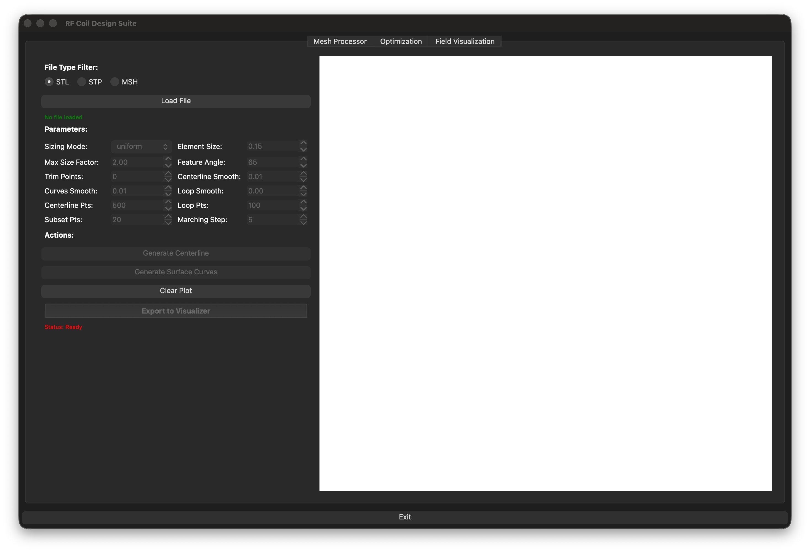

### Step 1.2: Select File Type and Load Your Coil Geometry

**File Type Selection:**

1. **Select the file type** using the radio buttons:
   - **STL**: Pre-meshed surface file (fastest, no mesh generation needed)
   - **STEP**: CAD file (requires mesh generation using Gmsh)
   - **MSH**: Previously generated Gmsh mesh file

2. **Initial State** (before loading any file):
   - All parameter fields are greyed out and disabled
   - Only the file type radio buttons, "Load File" button, and "Clear Plot" button are active

3. **Click "Load File"** and navigate to your coil geometry file

4. **After loading** - parameters become available based on file type:

   **For STL files:**
   - Only Feature Angle parameter is active
   - All meshing parameters remain greyed out (mesh already exists)
   - Processing parameters remain greyed out
   - "Generate Surface Curves" button becomes enabled
   - Red status message shows "Loaded STL file: [filename]"
   
   **For STEP files:**
   - All parameters become active (meshing + processing)
   - "Generate Surface Curves" button becomes enabled
   - Red status message shows progress of mesh generation
   - A .msh file is automatically created in the same directory

   **For MSH files:**
   - Meshing parameters remain greyed out (Sizing Mode, Element Size, Max Size Factor)
   - All processing parameters become active
   - "Generate Surface Curves" button becomes enabled
   - Red status message shows "Loaded MSH file: [filename]"

5. **Parameter Details:**

   **Meshing Parameters** (STEP files only):

   - **Sizing Mode**: 
     - **Uniform**: Consistent element size throughout mesh
     - **Curvature**: Finer mesh in curved regions, coarser in flat areas

   - **Element Size**: Base size for mesh elements in mm
     - Smaller values = finer mesh, longer mesh generation time
   
   - **Max Size Factor**: Multiplier applied to element size
     - Values > 1.0 make mesh coarser (faster)
     - Values < 1.0 make mesh finer (slower)

   **Processing Parameters** (availability depends on file type):

   - **Feature Angle**: Angle threshold for detecting coil end loops (available for all file types)
     - Range: 30-85 degrees
   
   - **Loop Smoothing**: Smoothing factor for end loops (STL and STEP only)
   
   - **Additional parameters** (MSH and STEP files):
     - **Trim Points**: Number of points to trim from centerline ends
     - **Centerline Smooth**: Spacing between centerline points (mm)
     - **Curves Smooth**: Spacing for surface curve generation (mm)
     - **Centerline Pts**: Number of points in centerline
     - **Loop Pts**: Number of points per loop
     - **Subset Pts**: Number of subset points for processing
     - **Marching Step**: Step size for marching algorithm
     - These fine-tune the centerline extraction and surface curve generation
     - Default values work well for most cases

> **Note**: When you load a STEP file, a `.msh` file is automatically generated and saved. You can reload this `.msh` file later to skip the meshing step, which saves significant time.

### Step 1.3: Automatic Centerline and Surface Curve Generation

**After loading your file, the application automatically:**

1. **Extracts the coil centerline** - Progress shown in red status message at top of Mesh Processor tab
2. **Generates surface curves** - Created immediately after centerline extraction

**What are surface curves?**
Surface curves represent an *approximation* of the current distribution on the coil conductor surface. In reality, current in a conductor forms a complex 3D distribution, but for AC currents at RF frequencies, the current concentrates near the surface due to the skin effect. These curves provide a reasonable approximation of this surface current distribution for electromagnetic field calculations.

**Theory Note**: The curves are automatically generated by:
1. Extracting the coil centerline from the mesh geometry
2. Creating a coordinate frame along the centerline
3. Generating circular curves perpendicular to the centerline at regular intervals
4. These curves lie on or near the conductor surface

The number of curves generated depends on the resolution of your centerline and the spacing parameters. More curves = more accurate field calculation but slower computation.

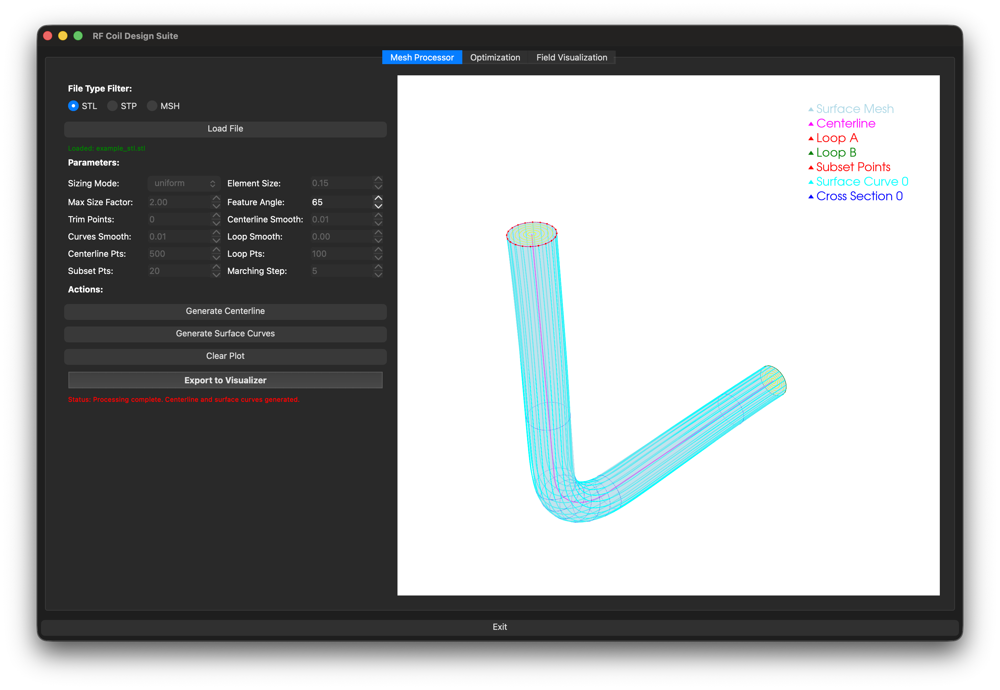

> **Manual Control**: If you need to regenerate the centerline or surface curves with different parameters:
> 1. Adjust the processing parameters (Feature Angle, Centerline Spacing, etc.)
> 2. Click **"Generate Surface Curves"** to regenerate with the new settings
> 3. Watch the red status messages for progress updates

### Step 1.4: Viewing and Clearing the Plot

**Visualization Controls:**
- After loading, the coil geometry, centerline, and surface curves are automatically plotted in the right 3D panel
- You can rotate the view by clicking and dragging
- Zoom with scroll wheel
- **"Clear Plot"** button: Clears the current visualization

### Step 1.5: Export to Field Visualizer

Once the automatic processing is complete (or after manually regenerating curves):

1. The **"Export to Visualizer"** button is located at the bottom of the left panel
2. Click **"Export to Visualizer"**
3. A confirmation message appears: "Data exported to Field Visualizer tab"

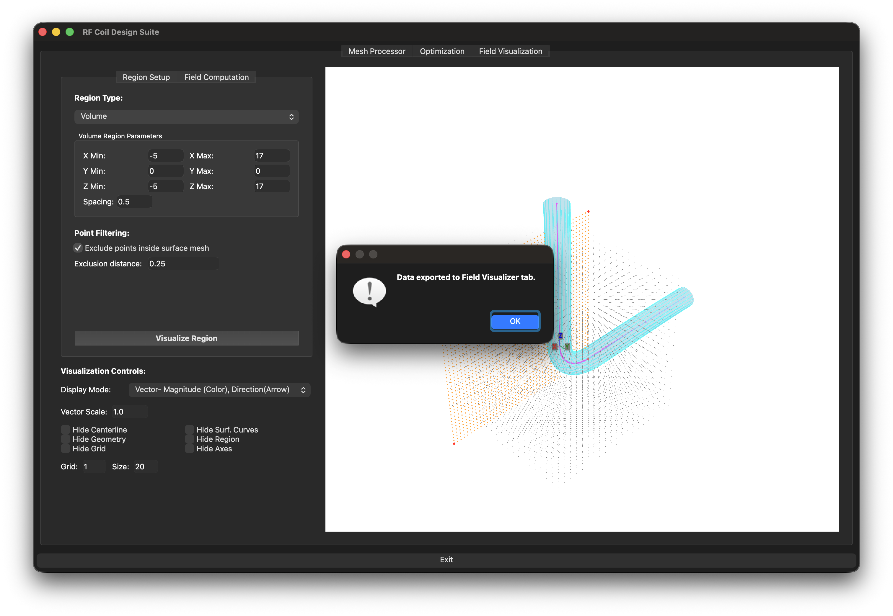

> **Tip**: The geometry, centerline, and surface curves are now available in the Field Visualization tab for electromagnetic field calculations.

---

## Tutorial 2: Computing Magnetic Fields

### Overview
Now that you have a coil loaded and processed, you'll compute the magnetic field (B-field) in a region around the coil using the Biot-Savart law.

### Step 2.1: Navigate to Field Visualization Tab

Click on the **"Field Visualization"** tab. If you completed Tutorial 1, your coil should already be loaded here.

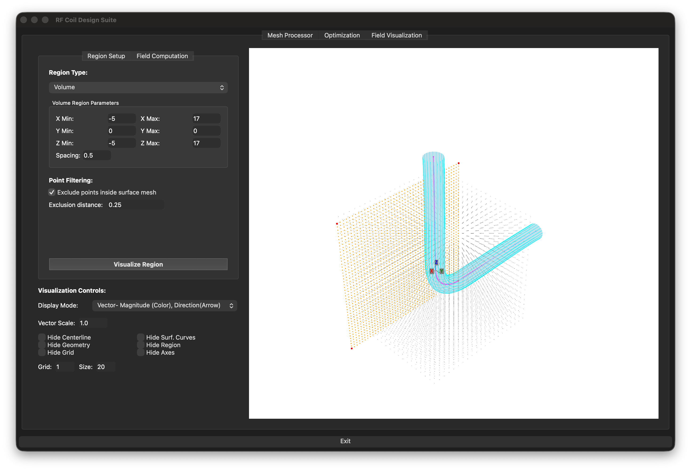

### Step 2.2: Define the Computation Region (Region Setup Tab)

You must define where you want to calculate the field. Click on the **"Region Setup"** tab in the left panel.

There are three region types available (select from dropdown at top):

#### Option A: Volume Region (3D Rectangular Region)

Best for calculating fields throughout a 3D space.

1. Select **"Volume"** from the Region Type dropdown

2. **Volume Region Parameters section**:
   - Row 1: X Min, X Max
   - Row 2: Y Min, Y Max
   - Row 3: Z Min, Z Max

3. **Spacing**: Distance between computation points
   - Smaller spacing = more points = more detail but slower computation

4. **Point Filtering section**:
   - **"Exclude points inside surface mesh"** checkbox
   - **Exclusion distance** field (default: 0.25 mm)
   - Useful to avoid computing fields inside the conductor itself
   - **Note**: Only works with surface meshes (STEP/STL/MSH files), not parametric coils from Optimization tab

5. **Visualize Region button** at bottom of Region Setup tab
   - Click to preview the volume region before computing
   - Shows: Orange points filling the volume + Red corner points marking the bounding box
   - Helps verify your region is correctly positioned

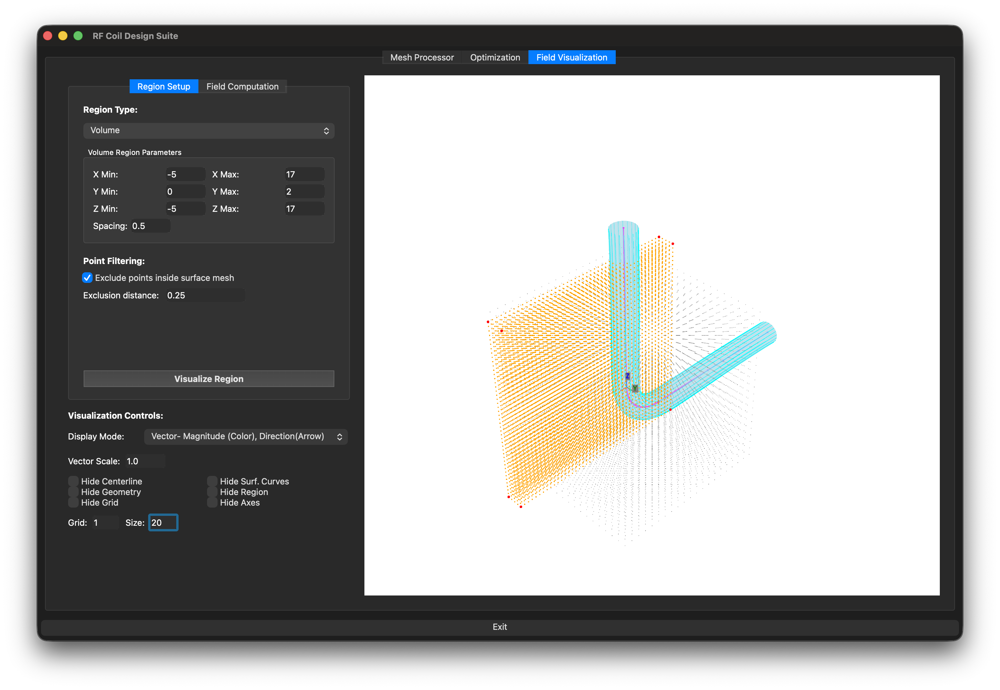

#### Option B: Plane Region (2D Planar Region)

Best for calculating fields on a specific plane (e.g., transverse slice through the coil).

1. Select **"Plane"** from the Region Type dropdown

2. **Plane Region Parameters** section appears:
   - **Origin**: Center point of the plane (x, y, z) - single line with comma-separated values
     - Example: `0, 0, 0` (center of coil)
   
   - **Normal**: Direction perpendicular to the plane (x, y, z)
     - Example: `1, 0, 0` (YZ plane)
     - Example: `0, 1, 0` (XZ plane)
     - Example: `0, 0, 1` (XY plane)
   
   - **Length**: Size along first plane axis (mm)
   - **Width**: Size along second plane axis (mm)
   - **Spacing**: Distance between points (mm)

3. **Visualize Region button** at bottom
   - Shows: Orange points on the plane + Red corner points + Red arrow showing normal direction

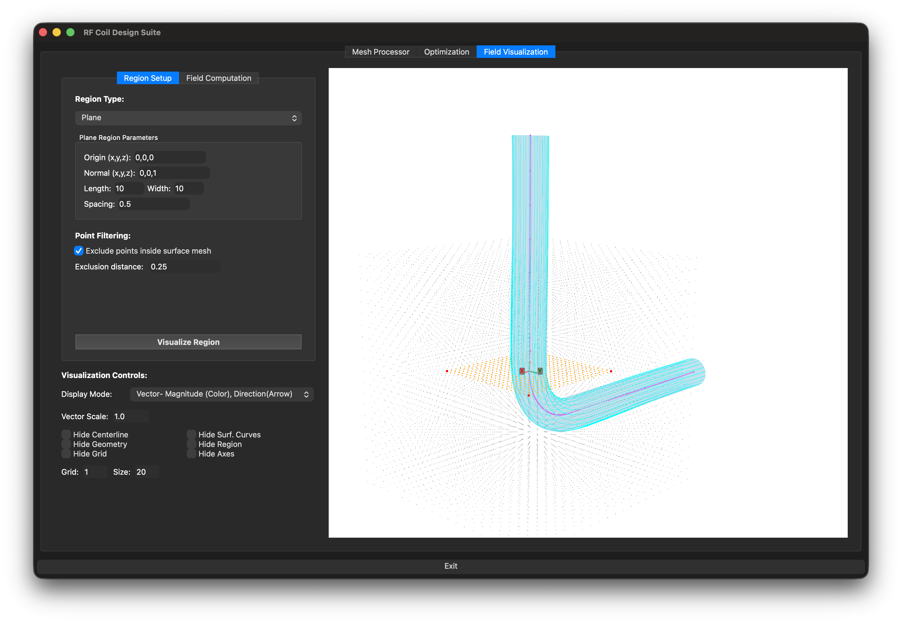

#### Option C: Line Region (1D Linear Region)

Best for calculating fields along a specific line (e.g., along the coil axis).

1. Select **"Line"** from the Region Type dropdown

2. **Line Region Parameters** section appears:
   - **Start Point**: (x, y, z) coordinates - comma-separated
  
   - **End Point**: (x, y, z) coordinates - comma-separated
   
   - **Number of Points**: How many points along the line

3. **Visualize Region button** at bottom
   - Shows: Orange line connecting points + Red endpoint markers

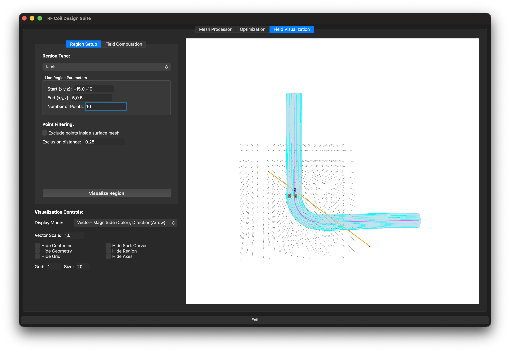

### Step 2.3: Visualize the Region

Before computing fields, preview your region:

1. Click **"Visualize Region"** at the bottom of the Region Setup tab
2. The 3D view shows:
   - Your coil geometry (if "Hide Geometry" is unchecked)
   - The computation region (orange points/lines)
   - Reference markers (red corners/endpoints)
   - Coordinate axes (if "Hide Axes" is unchecked)
   - Grey reference grid (if "Hide Grid" is unchecked)

3. Verify the region covers your area of interest
4. Adjust parameters and re-visualize if needed

### Step 2.4: Configure Field Computation Settings

Click on the **"Field Computation"** tab in the left panel.

**Field Type section:**
1. Select **"B-field (magnetic)"** from the dropdown
   - B-field: Magnetic flux density (Tesla)
   - E-field: Electric field (requires frequency, currently disabled)

2. **Frequency** field below (greyed out for B-field)
   - Only active when E-field is selected

**Current Path section:**

3. Choose current source:
   - **"Surface Curves"** Uses the generated surface curves for more accurate results
   - **"Centerline"**: Uses only the centerline (faster but less accurate)

1. **Coil Current (A)**: Enter the current in Amperes
   - Field magnitude scales linearly with current

**Inductance Calculation section:**

5. **"Compute Inductance from B-Field"** button
   - Only works if you computed B-field over a volume that fully encloses the coil
   - Results shown in "Inductance:" field below
   - Note: Volume must completely contain the coil

**Export Settings section:**

6. **Base Name** field for CSV export
   - Example: `coil_field_volume`

**Action buttons at bottom:**

7. **"Compute Field"** button (primary action)
8. **"Export Data"** button (saves results to CSV)

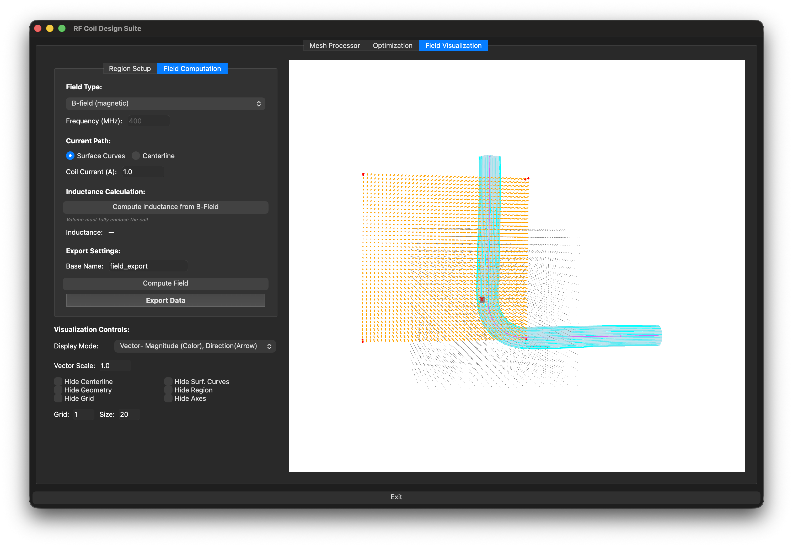

### Step 2.5: Compute the Field

1. Click **"Compute Field"** at the bottom of the Field Computation tab
2. Watch the terminal for progress messages
3. Computation time depends on number of points and whether using surface curves or centerline

> **Note**: For large numbers of points, computation may take a while.

### Step 2.6: Visualize the Results

After computation completes, the field is automatically displayed. Use the **Visualization Controls** (always visible at bottom of left panel) to customize the display:

**Display Mode dropdown** (9 options):
1. **"Vector- Magnitude (Color), Direction(Arrow)"**: Points colored by |B|, arrows show direction (best overview)
2. **"Vector, Magnitude & Direction"**: Combined vector and scalar view
3. **"Magnitude"**: Scalar field showing only |B| values (good for identifying peaks)
4. **"Bx (Color Only)"**: X-component as color map
5. **"Bx (Arrow)"**: X-component as arrows
6. **"By (Color Only)"**: Y-component as color map
7. **"By (Arrow)"**: Y-component as arrows
8. **"Bz (Color Only)"**: Z-component as color map
9. **"Bz (Arrow)"**: Z-component as arrows

**Vector Scale**: Adjust arrow lengths (default: 1.0)

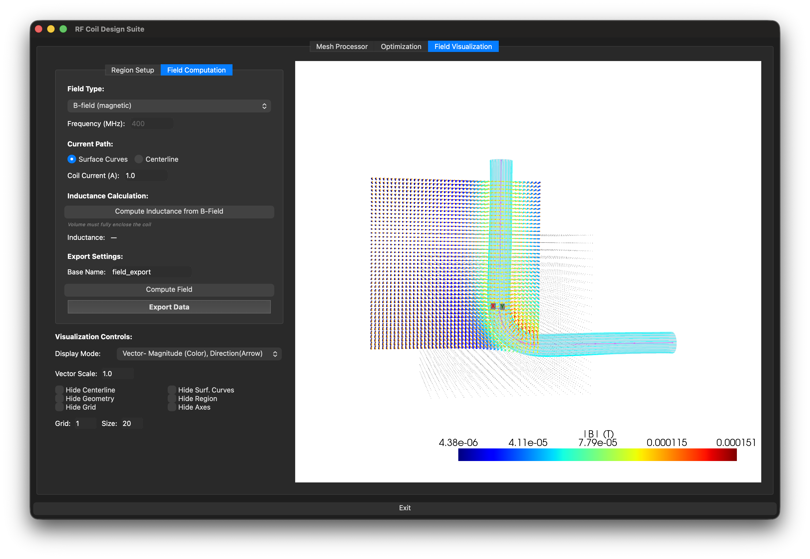

### Step 2.7: Adjust Visibility

Use the **6 checkboxes** in the Visualization Controls (2x3 grid layout):
- **Hide Centerline**: Toggle magenta centerline
- **Hide Surf. Curves**: Toggle cyan surface curves
- **Hide Geometry**: Toggle light blue coil surface mesh
- **Hide Region**: Toggle orange region points
- **Hide Grid**: Toggle grey reference grid points
- **Hide Axes**: Toggle XYZ coordinate axes

**Grid settings** (below checkboxes):
- **Grid**: Distance between grey reference points (default: 1 mm)
- **Size**: Total side length of cubic reference grid (default: 20 mm)

> **Tip**: Hide the geometry and region points to see field structure more clearly. The checkboxes update the view immediately.

### Step 2.8: Compute Inductance (Optional)

If you computed the B-field over a **volume that completely encloses the coil**:

1. In the Field Computation tab, click **"Compute Inductance from B-Field"**
2. The inductance value appears in the "Inductance:" field below the button

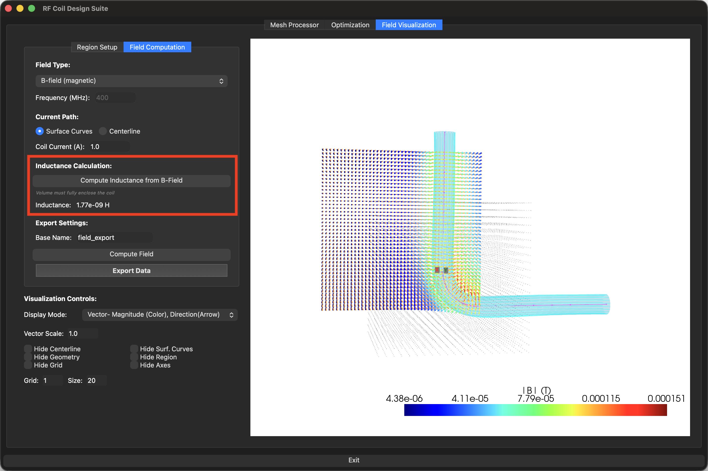

> **Important**: The volume must fully enclose the coil for accurate inductance calculation.

### Step 2.9: Export Data

To save your results:

1. In the Field Computation tab, enter a base filename in the **"Base Name"** field
   - Example: `coil_field_volume`

2. Click **"Export Data"** button at bottom of tab

3. A CSV file is created in the project directory:
   - Filename format: `[basename]-[regiontype][count].csv`
   - Example: `coil_field_volume-volume1.csv`
   - Contains columns: x, y, z, Bx, By, Bz (field values at each point)
   - The counter increments for each export of the same region type

4. Check the terminal for file save confirmation message showing the exact filename

---

## Tutorial 3: Using the Optimization Tab

### Overview
The Optimization tab allows you to generate populations of parametric coil designs and evaluate their magnetic field uniformity performance.

### Step 3.1: Navigate to Optimization Tab

Click on the **"Optimization"** tab.

**Optimization Tab Layout:**
- Contains three sub-tabs
  - **Coil**: Define parametric coil geometry and bounds
  - **Volume**: Define evaluation region for uniformity
  - **Population**: Generate and analyze coil populations
- **Status message** (red text): Shows generation progress at top
- **Panel**: 3D visualization area for coils

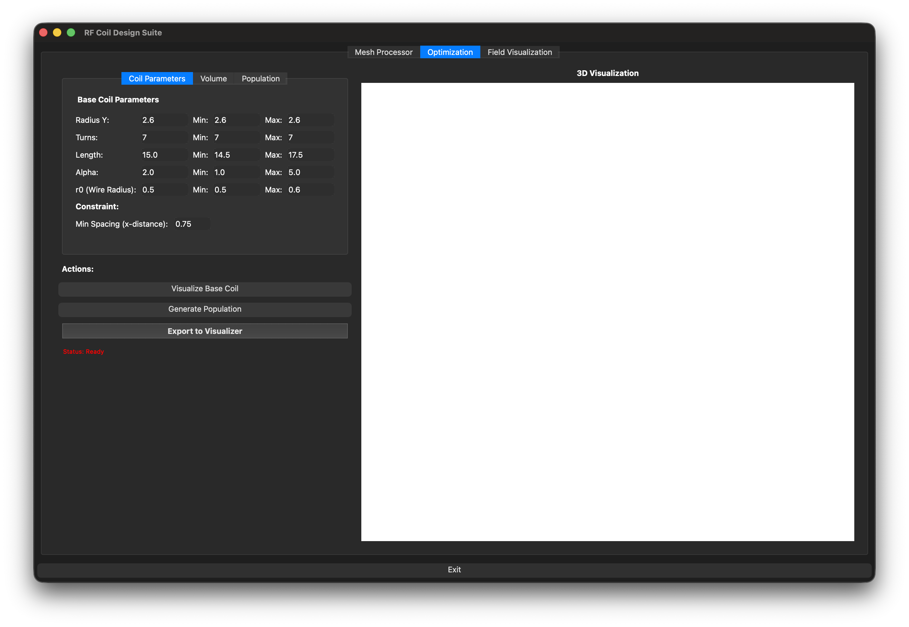

### Step 3.2: Configure Base Coil Parameters

Click on the **"Coil Parameters"** sub-tab in the left panel.

The Coil tab has 5 key parameters:

- **radius_y**: Coil radius in Y-Z plane (mm)
  - Controls coil diameter
  - Example: Value: 15, Min: 10, Max: 20

- **turns**: Number of helical turns
  - More turns = longer coil
  - Example: Value: 8, Min: 5, Max: 12

- **length**: Total coil length along X-axis (mm)
  - Example: Value: 60, Min: 40, Max: 80

- **alpha**: Sigmoid sharpness parameter
  - Controls turn spacing distribution
  - Higher = sharper transition, more uniform spacing
  - Example: Value: 2.0, Min: 1.0, Max: 5.0

- **r0**: Wire radius / cross-section radius (mm)
  - Example: Value: 1.5, Min: 0.5, Max: 3.0

**Min Turn Spacing** (below grid):
- Minimum allowed X-distance between adjacent turns (mm)
- Prevents turn overlap
- Example: 0.8 mm (recommended)

**"Visualize Base Coil" button** at bottom:
- Click to preview the base coil design with current parameter values
- Displays in right 3D panel

### Step 3.3: Define Evaluation Volume

Click on the **"Volume"** sub-tab.

This defines a cylindrical region where field uniformity will be evaluated for each generated coil.

**Volume Parameters organized in sections:**

**Dimensions section:**
- **Cylinder Radius**: Radius of evaluation cylinder (mm)
  - Typically smaller than coil radius
  - 
- **Length**: Length of evaluation cylinder along axis (mm)

**Axis section:**
- **Cylinder Axis**: Direction vector (x, y, z) - comma-separated
  - Example: `1, 0, 0` (along X-axis, parallel to coil axis)
  - Values are automatically normalized

**Sampling section:**
- **Spacing**: Distance between evaluation points (mm)
  - Finer spacing = more accurate but slower

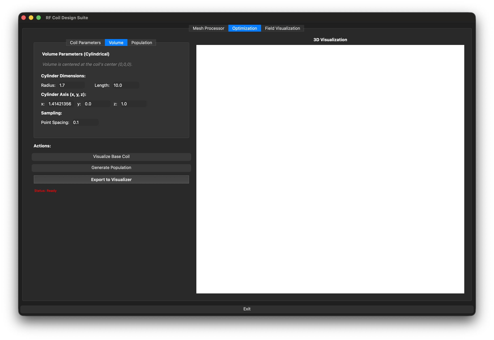

> **Note**: The evaluation cylinder is centered at the coil's geometric center (0, 0, 0).

### Step 3.4: Visualize Base Coil

Before generating a population, preview the base design:

1. Return to the **Coil** sub-tab
2. Click **"Visualize Base Coil"** at the bottom
3. Watch the status message for progress:
   - "Generating base coil..."
   - "Generating surface curves..."
   - "Rendering base coil..."
   - "Base coil visualization complete"
4. The coil appears in the right 3D panel with centerline and surface curves

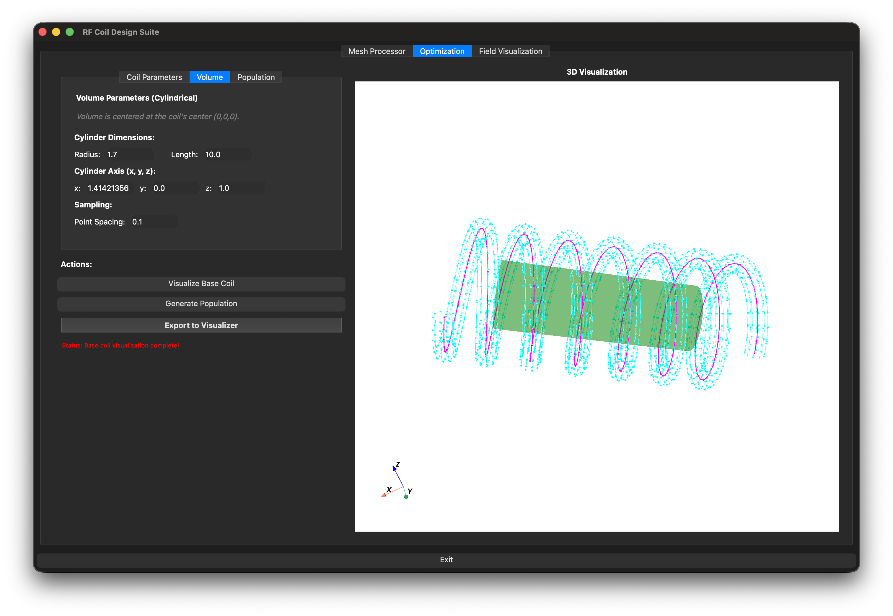
Adjust parameters and re-visualize until satisfied with the base design.

### Step 3.5: Generate Population

Click on the **"Population"** sub-tab.

**Generation section:**
1. **Population Size** field: Enter desired number of coils
   - Example: 50
   - Larger populations take longer to generate

2. Click **"Generate Population"** button

3. Watch the status messages for progress:
   - "Initializing population generation..."
   - "Generating sample X of Y..." (updates every 10%)
   - "Creating performance plot..."
   - "Visualizing first coil..."
   - "Population generation complete: Z coils generated"

4. **A 2D performance plot automatically appears** showing:
   - X-axis: Average |Bₓ| (field strength in evaluation volume)
   - Y-axis: Variance of Bₓ (field uniformity - lower is better)
   - Each point is a coil, labeled with its ID
   - This gives you an immediate overview of the population's performance

**Selection section:**

5. After generation, enter a **Coil ID** (0 to N-1)
6. Click **"View Selected Coil"** to visualize that specific design
7. A popup shows all parameter values for the selected coil

**Analysis section:**

8. **Performance Plot dropdown**: Select parameter to analyze
   - Options: none, radius_y, turns, length, alpha, r0
9. Click **"Show Performance Plot"**
10. Plot appears (see Step 3.7 for detailed explanation of plot types)

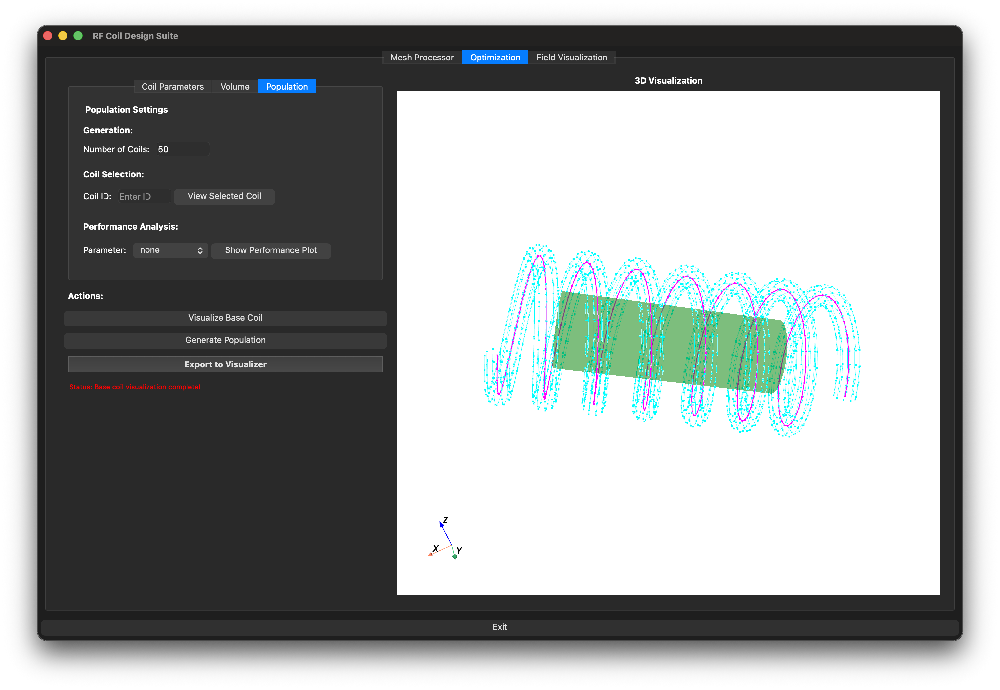
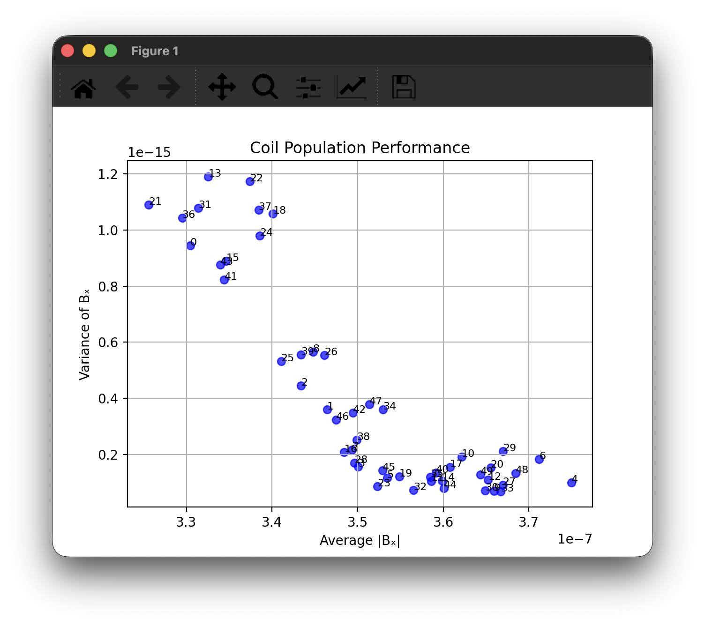

> **Note**: Generation time depends on population size and evaluation volume resolution. Expect 1-5 seconds per coil.

### Step 3.6: View Individual Coils

After generation completes:

1. Enter a **Coil ID** (0-based indexing, e.g., 0, 15, 42)
2. Click **"View Selected Coil"**
3. Status messages show:
   - "Searching for coil with ID X..."
   - "Loading coil X from population..."
   - "Generating surface curves..."
   - "Rendering coil..."
4. A popup window displays all parameters for that coil
5. The coil is rendered in the 3D panel

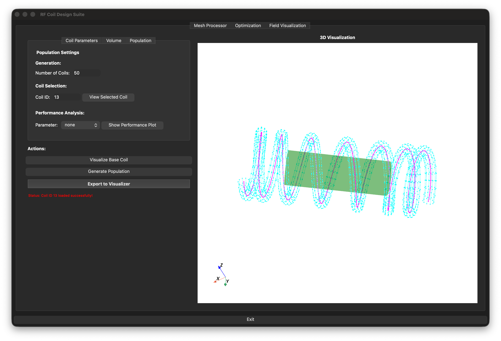

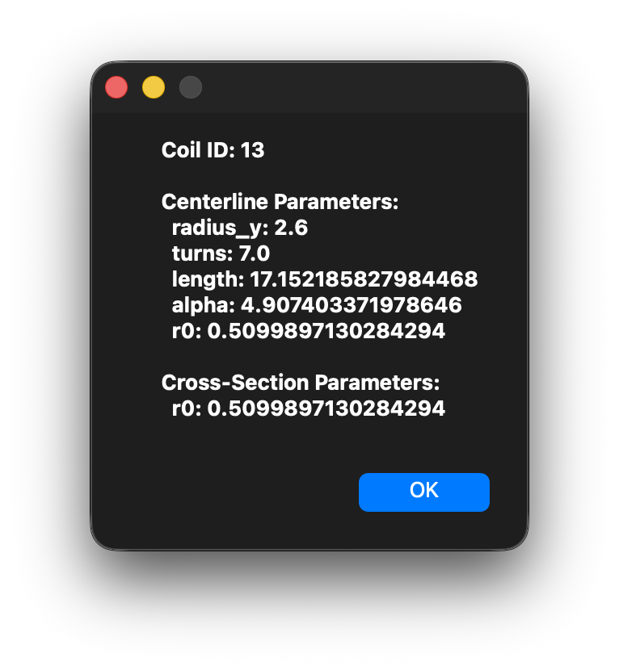

### Step 3.7: Analyze Performance

**Understanding Performance Plots:**

After generating a population, you can analyze how coil parameters affect field uniformity using performance plots.

**Automatic Plot (appears after population generation):**
- A 2D scatter plot automatically appears
- **X-axis**: Average |Bₓ|
- **Y-axis**: Variance of Bₓ
- **Points**: Each point represents one coil, labeled with its Coil ID
- The plot shows the trade-off between field strength and uniformity

**Manual Performance Analysis:**

To explore how specific parameters affect performance:

1. In the **Analysis section**, select a parameter from the dropdown:
   - **"none"**: Shows 2D plot (Average |Bₓ| vs. Variance)
   - **"radius_y"**: 3D plot showing how coil radius affects performance
   - **"turns"**: 3D plot showing how number of turns affects performance
   - **"length"**: 3D plot showing how coil length affects performance
   - **"alpha"**: 3D plot showing how turn spacing distribution affects performance
   - **"r0"**: 3D plot showing how wire radius affects performance

2. Click **"Show Performance Plot"**

3. **For 3D plots** (when a parameter is selected):
   - **X-axis**: Average |Bₓ|
   - **Y-axis**: Variance of Bₓ
   - **Z-axis**: The selected parameter value
   - Allows you to see trends - e.g., "Does increasing radius improve uniformity?"

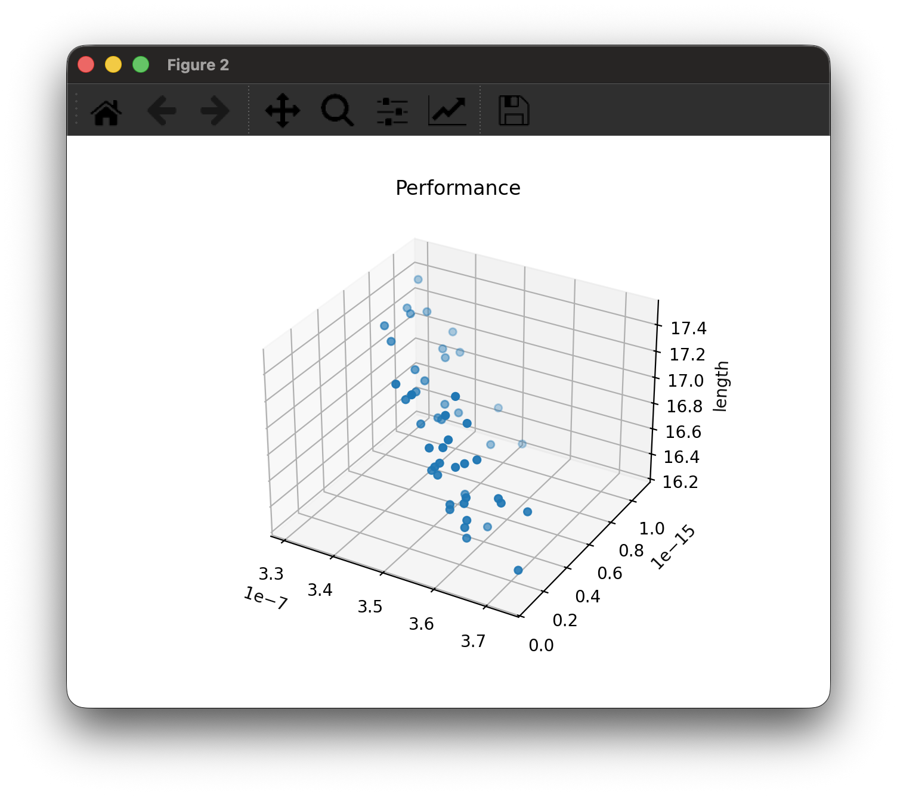

### Step 3.8: Export to Field Visualization

Once you find an interesting design:

1. View it using **"View Selected Coil"**
2. Scroll to bottom of left panel
3. Click **"Export to Visualizer"**
4. Status message confirms: "Coil exported to Field Visualization tab"
5. Navigate to Field Visualization tab - the parametric coil is now loaded

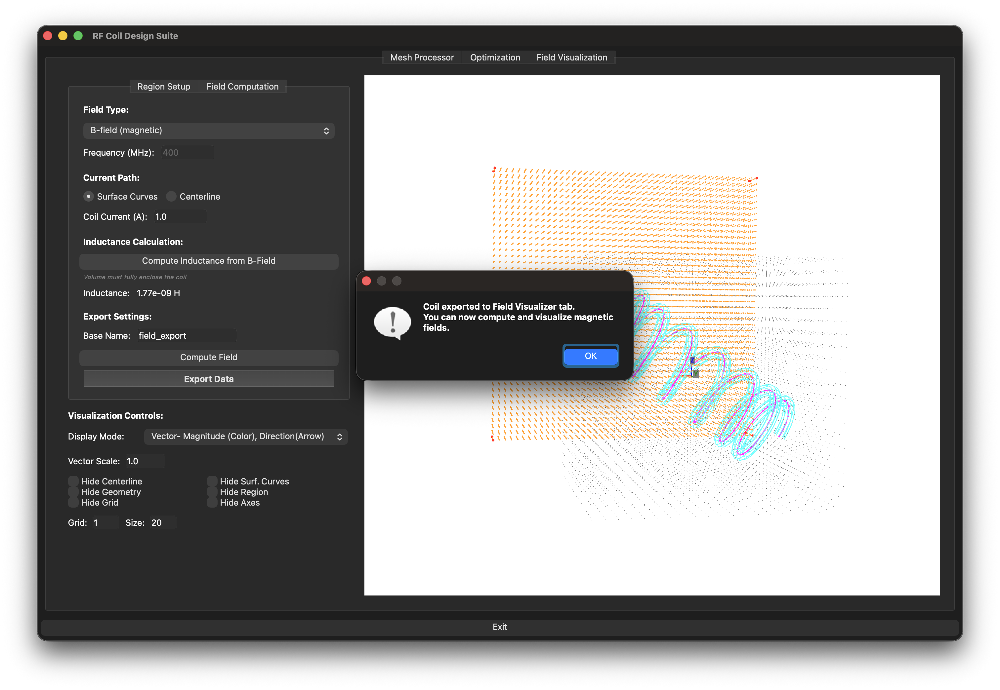

> **Note**: Parametric coils don't have volume meshes, so the "Exclude points inside surface mesh" feature won't work. You can still compute fields normally using centerline and surface curves.

---

## Advanced Topics

### Working with MSH Files

**Why use MSH files?**
- Mesh generation from STEP files can be time-consuming (especially for complex geometries)
- MSH files store the generated mesh for later reuse
- Skip the meshing step on subsequent runs

**To save/load MSH files:**
1. After loading a STEP file, a `.msh` file is automatically created in the same directory
2. Next time, select **"MSH"** radio button in Mesh Processor and load the `.msh` file directly
3. All processing (centerline, surface curves) works the same way
4. Meshing parameters remain greyed out (not needed for MSH files)

### Understanding Field Computation

**Surface Curves vs. Centerline:**

- **Centerline**: Treats the coil as an infinitely thin wire
  - Fast computation (single current path)
  - Less accurate, especially for thick conductors or high frequencies
  - Good for initial exploration and quick checks

- **Surface Curves**: Models current distribution on conductor surface
  - Slower computation
  - More physically accurate, accounts for skin effect
  - Accounts for conductor geometry and thickness
  - Recommended for final analysis and publication-quality results

**Current Value:**
- The Biot-Savart law is linear in current
- You can compute at 1 A, then scale results later: B_actual = B_computed × (I_actual / I_computed)
- Or compute at your actual operating current directly

### Field Magnitude Interpretation

The computed B-field magnitude is in Tesla (T):
- Typical NMR/MRI static fields: 1-20 T  
- Small RF coils B1 fields: 0.001 - 0.1 T at typical RF currents
- Remember: Field falls off with distance from coil (roughly as 1/r² for dipole-like geometries)

### Performance Metrics in Optimization

The "performance" value in optimization represents field uniformity:
- Lower values = more uniform field in the evaluation region
- Computed as coefficient of variation or standard deviation of field magnitude
- Evaluated only within the specified cylindrical volume
- Does not account for absolute field strength, only uniformity

---

## Troubleshooting

### Issue: Application doesn't start

**Symptoms:**
- Window doesn't appear
- Python error messages in terminal
- "ModuleNotFoundError" or "ImportError"

**Solution:**
- Ensure virtual environment is activated: `source venv/bin/activate` (macOS/Linux)
- Check that all dependencies are installed: `pip list`
- Verify PyQt5 installation: `pip show PyQt5`
- Try reinstalling dependencies: `pip install --upgrade -r requirements.txt`
- Check Python version: `python3 --version` (must be 3.8+)

### Issue: STEP file fails to load

**Symptoms:**
- Error message in terminal
- Application freezes during loading
- "Gmsh error" messages

**Possible causes:**
- Invalid STEP file format
- Gmsh not properly installed
- File path contains special characters
- Element size too small (mesh generation timeout)

**Solutions:**
- Verify STEP file opens in CAD software (FreeCAD, SolidWorks, etc.)
- Try increasing Element Size (e.g., from 1.0 to 3.0 mm)
- Adjust Feature Angle parameter
- Move file to a simple path without spaces or special characters
- Check Gmsh installation: open terminal and type `gmsh --version`

### Issue: "Exclude points inside mesh" doesn't work

**Symptoms:**
- Checkbox has no effect
- All volume points still visible

**Cause:** No surface mesh available (e.g., parametric coil from Optimization tab)

**Solution:** 
- This feature only works with STEP/STL/MSH files that have surface meshes
- For parametric coils, manually adjust your region definition to avoid the conductor
- Use exclusion distance of 0 to disable filtering

### Issue: Field computation is very slow

**Symptoms:**
- Computation takes many minutes
- Application appears frozen (but terminal shows activity)

**Solutions:**
- Reduce number of points: increase Spacing value (e.g., from 0.5 to 2.0 mm)
- Use smaller region (reduce bounding box size)
- Use centerline instead of surface curves for initial tests
- Consider using a Plane or Line region instead of Volume
- Close other applications to free CPU resources

### Issue: Visualization doesn't update when changing Display Mode

**Symptoms:**
- Display Mode dropdown changes but view doesn't update
- Old field visualization still visible

**Cause:** No field data computed yet, or view not refreshing

**Solution:** 
- Ensure you've clicked "Compute Field" before changing Display Mode
- The view should update automatically when changing Display Mode
- If not, try hiding/showing an element to force refresh

### Issue: Inductance calculation gives strange values

**Symptoms:**
- Inductance is negative
- Inductance is orders of magnitude wrong
- "NaN" or "Inf" values

**Possible causes:**
- Volume doesn't fully enclose the coil
- Too few computation points (large spacing)
- Current value is unusual
- B-field not computed yet

**Solutions:**
- Ensure your volume bounding box completely contains the coil
- Reduce spacing for more points (e.g., 1.0 mm or finer)
- Verify current value is reasonable (typically 1 A for testing)
- Compute B-field before attempting inductance calculation
- Check that region type is "Volume" (not Plane or Line)

### Issue: Out of memory errors

**Symptoms:**
- Python "MemoryError"
- Application crashes during computation
- System becomes unresponsive

**Cause:** Too many computation points (spacing too small or region too large)

**Solutions:**
- Increase spacing between points (e.g., from 0.25 to 1.0 mm)
- Reduce region size (smaller bounding box)
- Use a Plane or Line instead of Volume for initial testing
- Close other applications to free RAM
- For 32-bit Python, switch to 64-bit Python

### Issue: Red status messages not appearing

**Symptoms:**
- Status messages don't update
- Can't tell if processing is complete

**Cause:** UI not refreshing, or messages scrolled out of view

**Solution:**
- Look at terminal output for progress information
- Status messages appear at top of Mesh Processor and Optimization tabs
- Messages update during processing (e.g., "Generating sample X of Y...")

### Issue: Can't see grey reference grid

**Symptoms:**
- Grid checkbox unchecked but no grid visible
- Changed Grid settings but no visible effect

**Cause:** Grid might be outside the viewing area, or hidden by geometry

**Solutions:**
- Ensure "Hide Grid" checkbox is **unchecked**
- Adjust Grid Size to match your coil scale (e.g., if coil is 60mm long, try Size: 80)
- Zoom out to see if grid is outside initial view
- Hide geometry temporarily to see grid more clearly
- Check Grid Spacing - if too large, grid has very few points

### Issue: Parametric coil looks wrong after generation

**Symptoms:**
- Turns overlap
- Coil doesn't match expected shape
- Centerline has sharp kinks

**Cause:** Parameter bounds too permissive, min turn spacing too small

**Solutions:**
- Increase "Min Turn Spacing" (e.g., 0.8-1.0 mm)
- Narrow parameter bounds (Min/Max values)
- Increase alpha value for more uniform turn distribution
- Visualize base coil before generating population to verify parameters

---

## Tips for Best Results

### Mesh Processing
1. **Start coarse, refine later**: Use large element size (3-5 mm) for testing, refine to 1-2 mm for final results
2. **Save MSH files**: Reloading MSH files is much faster than regenerating from STEP
3. **Feature angle**: 75° works well for most coil geometries; increase for more aggressive feature detection
4. **Watch terminal output**: Provides valuable feedback on processing steps and errors

### Field Computation
1. **Start coarse**: Begin with large spacing (2-5 mm) to see general field structure
2. **Refine regions of interest**: Use finer spacing only where needed
3. **Use appropriate region types**: 
   - Volume: Full 3D field mapping, inductance calculation
   - Plane: Cross-sectional analysis, 2D field plots
   - Line: Axial field profiles, quick checks
4. **Surface curves for accuracy**: Use surface curves for final results, centerline for quick tests
5. **Compute at 1 A**: Simplifies scaling and comparisons across different coils

### Optimization
1. **Small populations first**: Start with 10-20 coils to test parameter bounds
2. **Reasonable bounds**: Keep Min/Max ranges realistic (e.g., don't vary radius by 10× )
3. **Coarse evaluation initially**: Use larger spacing (2-3 mm) in evaluation volume for speed
4. **Analyze performance plots**: Look for trends before generating larger populations
5. **Iterative refinement**: Narrow bounds based on first population, generate new population
6. **Min turn spacing**: Set to ~0.8 mm to prevent physical impossibilities

### Visualization
1. **Hide unnecessary elements**: Use checkboxes to declutter view
2. **Multiple visualization modes**: Try different Display Modes for different insights
   - Magnitude: Find peak locations
   - Vector: Understand field direction
   - Component views: Analyze individual Bx/By/Bz contributions
3. **Adjust vector scale**: Make arrows longer or shorter for clarity
4. **Use grid reference**: Grey grid helps understand spatial scale
5. **Export data for post-processing**: CSV files allow external analysis (MATLAB, Python, Excel)

### General Workflow
1. **Monitor terminal**: Keep terminal visible for error messages and progress
2. **Save work frequently**: Export geometries and field data after successful computations
3. **Document parameters**: Use meaningful export filenames that include key parameters
4. **Incremental complexity**: Start simple (centerline, coarse grid), increase complexity gradually

---

## Example Workflows

### Workflow 1: Analyzing an Existing Coil Design

1. **Mesh Processor tab**: Load STEP file → Automatic processing generates centerline + surface curves
2. Click **"Export to Visualizer"**
3. **Field Visualization tab → Region Setup**: Define Volume region around coil (e.g., ±10 mm in all directions, 1 mm spacing)
4. Click **"Visualize Region"** to verify placement
5. **Field Computation tab**: Select B-field, Surface Curves, 1.0 A current
6. Click **"Compute Field"**
7. **Visualization Controls**: Try different Display Modes (Magnitude, Vector, Component views)
8. Hide geometry and region to see field structure clearly
9. **Field Computation tab**: Click **"Compute Inductance from B-Field"**
10. Enter export basename and click **"Export Data"**
11. Analyze CSV files in external tools

### Workflow 2: Optimizing Coil Geometry for Uniformity

1. **Optimization tab → Coil sub-tab**: Set parameter bounds based on design constraints
2. Click **"Visualize Base Coil"** to verify starting point looks reasonable
3. **Volume sub-tab**: Define evaluation volume (target uniform field region)
4. **Population sub-tab**: Generate small population (20 coils) with coarse spacing
5. Click **"Show Performance Plot"** for each parameter to identify trends
6. **Coil sub-tab**: Narrow parameter bounds based on trends (e.g., if larger radius is better, increase Min radius)
7. **Population sub-tab**: Generate new population (50 coils) with refined bounds
8. Identify best coil (lowest performance score), click **"View Selected Coil"**
9. Click **"Export to Visualizer"**
10. **Field Visualization tab**: Compute detailed field with fine spacing to verify performance
11. Export final design data

### Workflow 3: Quick Field Check Along Coil Axis

1. **Mesh Processor tab**: Load STL or MSH file (fast loading)
2. Click **"Export to Visualizer"**
3. **Field Visualization tab → Region Setup**: Select **Line** region
4. Set Start Point: `0, 0, -30`, End Point: `0, 0, 30`, Number of Points: 50
5. Click **"Visualize Region"** to confirm line placement
6. **Field Computation tab**: Select B-field, Centerline (fast), 1.0 A
7. Click **"Compute Field"**
8. **Display Mode**: Select "Magnitude" to see |B| along axis
9. Export data for plotting in external tool

### Workflow 4: Creating Publication-Quality Field Maps

1. **Mesh Processor tab**: Load coil, ensure surface curves are well-resolved
2. **Field Visualization tab → Region Setup**: Define Plane region at center of coil
3. Set fine spacing (0.25-0.5 mm) for high resolution
4. Click **"Visualize Region"** to verify plane orientation
5. **Field Computation tab**: Use **Surface Curves** for accuracy
6. Click **"Compute Field"** (may take several minutes)
7. **Display Mode**: Select "Magnitude" or "Vector- Magnitude (Color), Direction(Arrow)"
8. Hide unnecessary elements (geometry, axes, grid) for clean view
9. Take screenshot or use PyVista's export features
10. Export CSV data for external plotting tools (matplotlib, Origin, etc.)

---

## Conclusion

This tutorial has covered the complete workflows for the RF-Coil B1 Field Simulator. With practice, you'll be able to:

- Import and process coil geometries from various file formats
- Compute electromagnetic fields efficiently using the Biot-Savart law
- Optimize parametric coil designs for field uniformity
- Analyze and visualize field distributions in 3D
- Export data for further analysis in external tools

For more detailed information on parameters, theory, and advanced features, see the README.md file.

